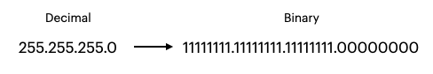
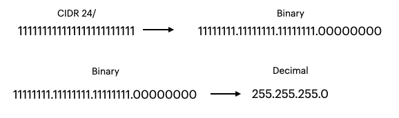

<div id="top"></div>

<!-- PROJECT SHIELDS -->

[![Contributors][contributors-shield]][contributors-url]
![Language][language-shield]
![Repo Size][reposize-shield]
![Last Commit][last-commit-shield]
[![LinkedIn][linkedin-shield]][linkedin-url]
[![Medium][medium-shield]][medium-url]
[![Twitter][twitter-shield]][twitter-url]

<!-- PROJECT LOGO -->
<br />
<div align="center">
  <a href="https://github.com/trujillo9616/SRE-Bootcamp-Capstone-Project-Q12023">
    
  </a>

<h3 align="center">SRE Capstone Project</h3>

  <p align="center">
    Capstone Project for the <a href="https://academy.wizeline.com/site-reliability-engineering/">Wizeline Academy SRE Bootcamp</a>
    <br />
    <a href="https://github.com/trujillo9616/SRE-Bootcamp-Capstone-Project-Q12023"><strong>Explore the docs »</strong></a>
    <br />
    <br />
    <a href="https://github.com/trujillo9616/SRE-Bootcamp-Capstone-Project-Q12023">View Demo</a>
    ·
    <a href="https://github.com/trujillo9616/SRE-Bootcamp-Capstone-Project-Q12023/issues">Report Bug</a>
    ·
    <a href="https://github.com/trujillo9616/SRE-Bootcamp-Capstone-Project-Q12023/issues">Request Feature</a>
  </p>
</div>

<!-- TABLE OF CONTENTS -->
<details>
  <summary>Table of Contents</summary>
  <ol>
    <li>
      <a href="#about-the-project">About The Project</a>
      <ul>
        <li><a href="#built-with">Built With</a></li>
      </ul>
    </li>
    <li>
      <a href="#getting-started">Getting Started</a>
      <ul>
        <li><a href="#prerequisites">Prerequisites</a></li>
        <li><a href="#installation">Installation</a></li>
      </ul>
    </li>
    <li><a href="#usage">Usage</a></li>
    <li><a href="#roadmap">Roadmap</a></li>
    <li><a href="#contributing">Contributing</a></li>
    <li><a href="#contact">Contact</a></li>
    <li><a href="#acknowledgments">Acknowledgments</a></li>
  </ol>
</details>

<!-- ABOUT THE PROJECT -->

## About The Project

### What is the project about?

This project is a REST API that allows authenticated users to convert IPv4 subnet masks into CIDR notation and vice versa.

The purpose of this project is to demonstrate the skills learned during the Wizeline Academy SRE Bootcamp. The project is deployed on AWS using Docker containers and a MySQL database.

### What are CIDR and Subnet Masks?

CIDR (Classless Inter-Domain Routing) is a method of allocating IP addresses and IP routing. CIDR is a superset of the older system of allocating IP addresses, known as Classful Inter-Domain Routing (CIDR). CIDR uses a variable-length subnet mask, which allows for more efficient use of IP addresses. CIDR is used in IPv4 and IPv6.

A subnet mask is a 32-bit number that is used to divide an IP address into network and host parts. The subnet mask is used to determine which part of the IP address is the network address and which part is the host address. The subnet mask is also used to determine the number of hosts that can be assigned to a network.

### How do IP Addresses work?

IPv4 addresses are really just decimal representations of four binary blocks. Each block is 8 bits long, and the maximum value of a 8-bit binary number is 255. So, the maximum value of an IPv4 address is 255.255.255.255. This is why IPv4 addresses are written in dotted decimal notation, because it makes it easier to read and understand.

### What is Subnetting?

Addresses based on the IPv4 format metioned earlier might seem like almost unlimited. After all, there are almost 4.2 billion possible IPv4 addresses. However, if you think about the size of the internet and its growth during the past decades, you will realize that the number is simply not enough. This is why engineers devised a way to divide the IPv4 address space into smaller nets. This is called subnetting.

### What is a Subnet Mask?

A subnet mask is a 32-bit number that is used to divide an IP address into network and host parts. The subnet mask is used to determine which part of the IP address is the network address and which part is the host address. The subnet mask is also used to determine the number of hosts that can be assigned to a network.

### How to Calculate CIDR Notation?

To figure out the CIDR notation for a given subnet mask, all you need to do is convert the subnet mask into binary and count the number of 1s. For example, the subnet mask:

<div align="center">
  
</div>

Beacuse there are 24 1s in the binary representation of the subnet mask, the CIDR notation for this subnet mask is /24.

### How to Calculate Subnet Mask?

To calculate the subnet mask for a given CIDR notation, all you need to do is convert the CIDR notation into binary and fill in the remaining bits with 0s. Then divide into 8-bit blocks and convert each block into decimal. For example, the CIDR notation /24:

<div align="center">
  
</div>

### Built With

#### Server

- [TypeScript](https://www.typescriptlang.org/)
- [Node.js](https://nodejs.org/en/)
- [Express](https://expressjs.com/)
- [Swagger](https://swagger.io/)

#### Testing

- [Mocha](https://mochajs.org/)
- [Chai](https://www.chaijs.com/)

#### Database

- [Prisma](https://www.prisma.io/)
- [MySQL](https://www.mysql.com/)

#### Deployment

- [AWS](https://aws.amazon.com/)
- [Docker](https://www.docker.com/)
- [GitHub Actions](https://docs.github.com/en/actions)
- [Terrafom](https://www.terraform.io/)

<p align="right">(<a href="#top">back to top</a>)</p>

<!-- GETTING STARTED -->

## Getting Started

To get a local copy up and running follow these simple example steps.

### Prerequisites

Prior to installing and downloading the files you will need to have Node.js installed. You can find the installation instructions [here](https://nodejs.org/en/). Or run the following command to install Node if using Mac OS. I recommend using a node version manager such as [nvm](https://github.com/nvm-sh/nvm) to manage your node versions easily.

```sh
brew install node
```

Not a hard prerequisite, but having docker will get things up and running faster. You can find the installation instructions for Docker Desktop [here](https://docs.docker.com/desktop/). Or run the following command to install Docker if using Mac OS.

```sh
brew install --cask docker
```

If you want a more lightweight version of Docker, you can install Docker Engine. You can find the installation instructions [here](https://docs.docker.com/engine/install/).

## Installation and Setup

### First Steps

Clone the repo

```sh
git clone https://github.com/trujillo9616/SRE-Bootcamp-Capstone-Project-Q12023.git
```

Move into the project directory

```sh
cd node
```

### Using Docker

1. Run the docker-compose file
   ```sh
   yarn docker:compose
   ```

### Without Docker

1. Install dependencies
   ```sh
   yarn install
   ```
2. Build the project
   ```sh
   yarn build
   ```
3. Start the server
   ```sh
   yarn start
   ```

### Final Step

Test the API using Postman or Swagger

- Visit http://localhost:8000/api/docs to view the Swagger documentation
- Or check out the Postman collection [here](https://elements.getpostman.com/redirect?entityId=19969340-240a185d-0cf1-460a-8cfb-ba97d9ba06ac&entityType=collection)

<p align="right">(<a href="#top">back to top</a>)</p>

<!-- USAGE EXAMPLES -->

## Usage

This API allows users to convert IPv4 subnet masks into CIDR notation and viceversa. The API is deployed on AWS using Docker containers and a MySQL database.

### Endpoints

#### GET /api/

This endpoint returns a status message.

#### GET /api/\_health

This endpoint returns a status message.

#### POST /api/login

This endpoint allows users to login to the API. The user must provide a valid username and password. The API will return a JWT token that can be used to access the other endpoints.

#### GET /api/cidrToMask?value={value}

This endpoint converts a CIDR notation into a subnet mask. The user must provide a valid CIDR notation in the query string. The API will return the subnet mask in dotted decimal notation.

#### GET /api/maskToCidr?value={value}

This endpoint converts a subnet mask into a CIDR notation. The user must provide a valid subnet mask in the query string. The API will return the CIDR notation.

<p align="right">(<a href="#top">back to top</a>)</p>

<!-- TESTING -->

## Testing

To run the tests, run the following command

```sh
yarn test
```

<!-- ROADMAP -->

## Roadmap

List of planned features:

- Add more tests
- Add more environments (dev, staging, prod)

See the [open issues](https://github.com/trujillo9616/SRE-Bootcamp-Capstone-Project-Q12023/issues) for a full list of proposed features (and known issues).

<p align="right">(<a href="#top">back to top</a>)</p>

<!-- CONTRIBUTING -->

## Contributing

Contributions are what make the open source community such an amazing place to learn, inspire, and create. Any contributions you make are **greatly appreciated**.

If you have a suggestion that would make this better, please fork the repo and create a pull request. You can also simply open an issue with the tag "enhancement".
Don't forget to give the project a star! Thanks again!

1. Fork the Project
2. Create your Feature Branch (`git checkout -b feature/AmazingFeature`)
3. Commit your Changes (`git commit -m 'Add some AmazingFeature'`)
4. Push to the Branch (`git push origin feature/AmazingFeature`)
5. Open a Pull Request

<p align="right">(<a href="#top">back to top</a>)</p>

<!-- CONTACT -->

## Contact

Adrian Trujillo - [@trujillo9616](https://twitter.com/trujillo9616)

Project Link: [https://github.com/trujillo9616/SRE-Bootcamp-Capstone-Project-Q12023](https://github.com/trujillo9616/SRE-Bootcamp-Capstone-Project-Q12023)

<p align="right">(<a href="#top">back to top</a>)</p>

<!-- ACKNOWLEDGMENTS -->

## Acknowledgments

- Daniel Castellanos for his support and guidance
- Everyone involved in the Wizeline Academy SRE Bootcamp

<p align="right">(<a href="#top">back to top</a>)</p>

<!-- MARKDOWN LINKS & IMAGES -->

[contributors-shield]: https://img.shields.io/github/contributors/trujillo9616/SRE-Bootcamp-Capstone-Project-Q12023?style=plastic
[contributors-url]: https://github.com/trujillo9616/SRE-Bootcamp-Capstone-Project-Q12023/graphs/contributors
[language-shield]: https://img.shields.io/github/languages/top/trujillo9616/SRE-Bootcamp-Capstone-Project-Q12023?style=plastic
[reposize-shield]: https://img.shields.io/github/repo-size/trujillo9616/SRE-Bootcamp-Capstone-Project-Q12023?style=plastic
[last-commit-shield]: https://img.shields.io/github/last-commit/trujillo9616/SRE-Bootcamp-Capstone-Project-Q12023?style=plastic
[twitter-shield]: https://img.shields.io/twitter/follow/trujillo9616?style=social
[twitter-url]: https://twitter.com/trujillo9616
[linkedin-shield]: https://img.shields.io/badge/LinkedIn-Connect-blue?style=social&logo=linkedin
[linkedin-url]: https://www.linkedin.com/in/adrian-trujillo96/
[medium-shield]: https://img.shields.io/badge/Medium-Connect-black?style=social&logo=medium
[medium-url]: https://medium.com/@adrian.td96
